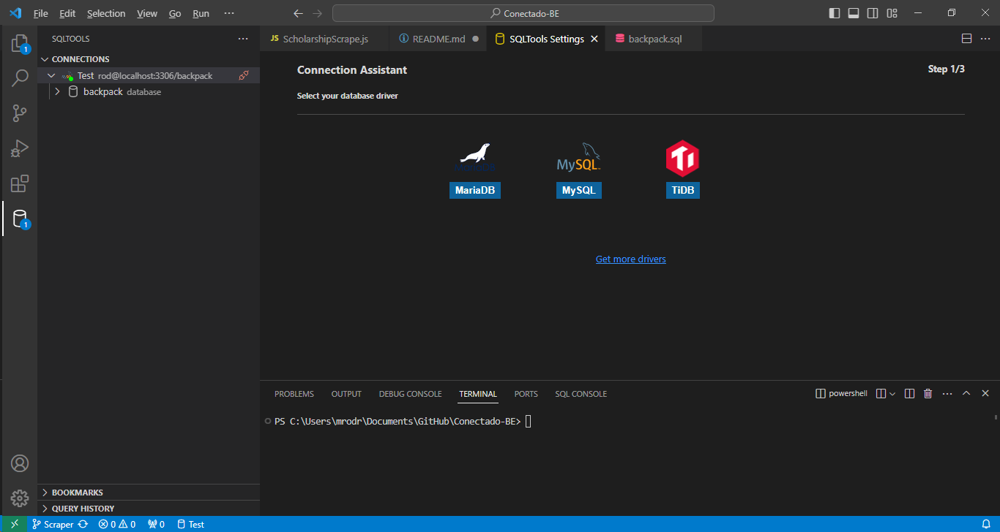

FOR INDEED SCRAPER
1. You will need node.js
   
2. You will also need to install crawlee
  npx crawlee create my-crawler
  npm install crawlee playwright

1. This is a web scraper that can scrape relevant info on oppourtunities from Indeed.com
2. You can visit a link such as this one https://www.indeed.com/jobs?l=merced&radius=50, this looks for jobs on indeed within a 50 mile radius of merced.
3. You can put this link in the main.js file and it will scrape the page and store relevant info into the scrapedData.json file

FOR SCHOLARSHIP SCRAPE

1. you should have the database setup in your system, if you're using visual studio cocde, you can download MYSQL and MYSQLTools in order to view and modify the database.

2. Once you have both installed, you can connect to the sql database with the command;
 mysql -u 'user' - p 'password' in the terminal

3. after you login with the appropriate user you can create the table with the data using the command
USE your_database_name; (whatever you decide to name it)

4. Use the command to make the backpack.sql file the actual database;
source /path/to/your_file.sql;

5. Once that is setup open mySQLTools to setup the server and watch the changes live;
  you click on add a new connection which should open a SQL Tab
  
  then you click on mySQL which will take you to the configuration tab, you fill in the data, making sure you match the data from config.js (you can change whichever to match the other one).

6. you can now click on the test connection and it should establish one if done correctly.

7. you can now use the code that interacts with the database.

